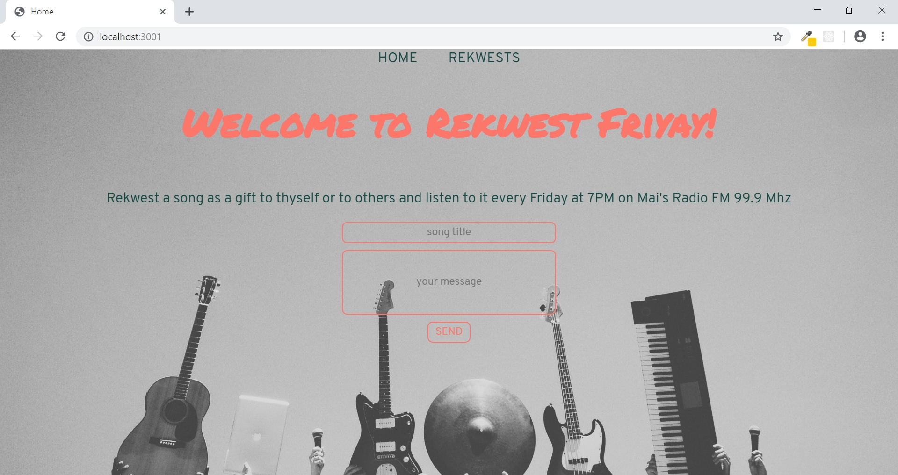
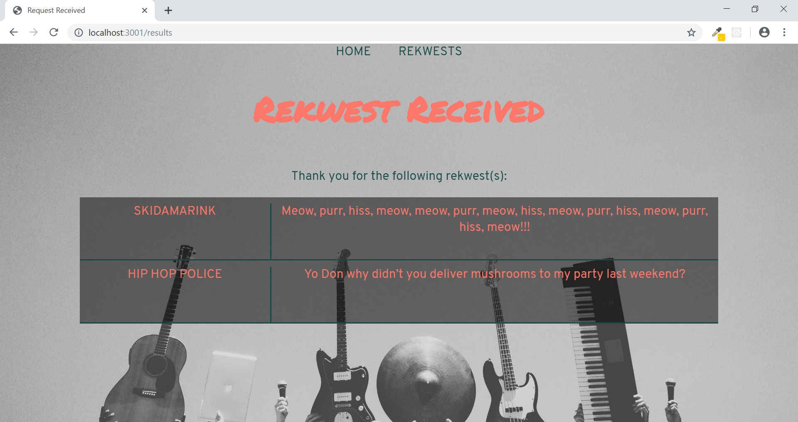
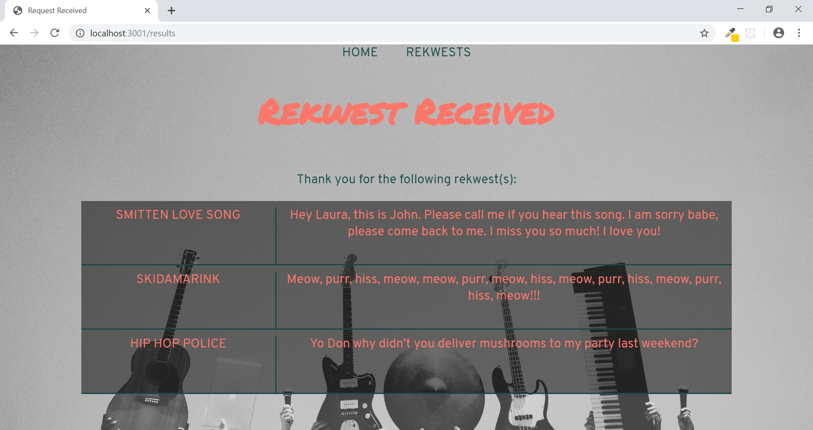

# Bulletin-Board-App
This is a website that allows people to post messages; a message consists of a title and a body.
* Postgres SQL
* Node JS
* Javascript
* Dependencies: dotenv, ejs, express, pg, pg-hstore

**Context:** a website of a radio station, where the audience can request a song to be aired on Fridays. The radio host will play the song and read out the messages.

**Color combo:** Living Coral (#FC766AFF), Storm Gray (#B0B8B4FF), and Forest Biome (#184A45FF)

The first page shows people a form where they can add a new message:

After submitting the message, user will be redirect to the second page - a board that shows each of the messages people have posted:

The newest message appears on the top row of the board:

